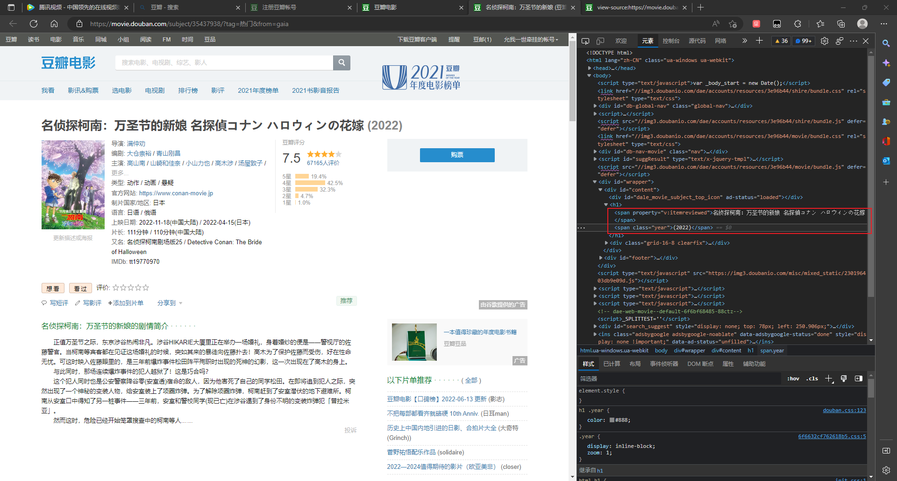
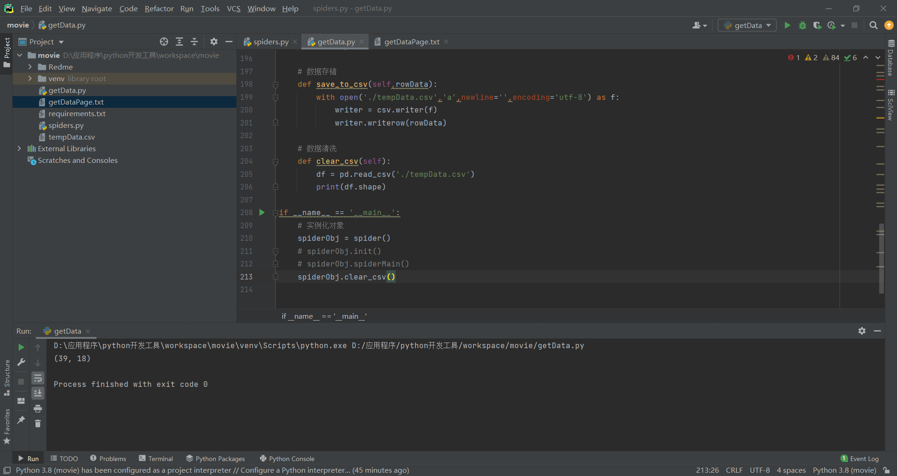

# 备用 'https://movie.douban.com/j/search_subjects?type=movie&tag=热门'
#  myh "User-Agent": "Mozilla/5.0 (Windows NT 10.0; Win64; x64; rv:104.0) Gecko/20100101 Firefox/104.0"

https://movie.douban.com/j/new_search_subjects?sort=U&range=0,10&tags=&start=20
Mozilla/5.0 (Windows NT 10.0; Win64; x64) AppleWebKit/537.36(KHTML,like Gecko) Chrome/102.0.0.0 Safari/537.36

爬取名字和年份
from lxml import etree
respDetailHTMLXpath

